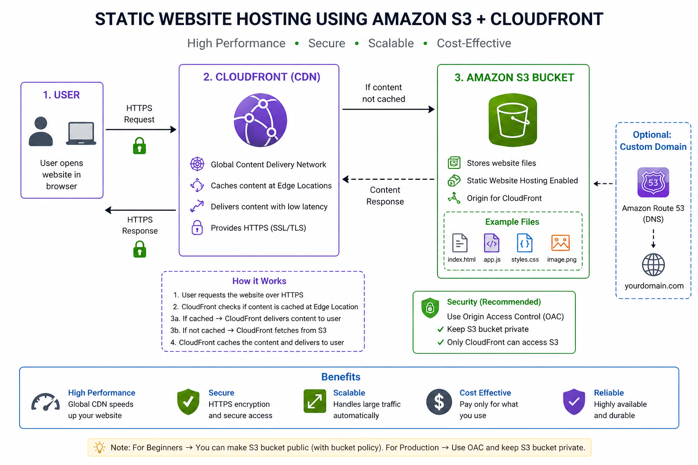

# 🚀 Static Website Hosting using Amazon S3 + CloudFront

## 📌 Project Overview

This project demonstrates how to host a **static website** using **Amazon S3** and **Amazon CloudFront** with a secure and scalable architecture.

---

## 🏗️ Architecture Diagram



---

## 🧠 Architecture Explanation

* User sends request via browser
* CloudFront (CDN) receives request
* If cached → returns response instantly
* If not cached → fetches from S3
* S3 returns website files (HTML, CSS, JS)
* CloudFront delivers content over HTTPS

---

## ⚙️ Technologies Used

* Amazon S3 (Storage)
* Amazon CloudFront (CDN)
* HTTPS (SSL/TLS)
* (Optional) Route 53 (DNS)

---

## 📋 Step-by-Step Setup

### 🔹 Step 1: Create S3 Bucket

* Go to AWS Console → S3
* Create bucket: `nancymishrawebsite`
* Choose region

---

### 🔹 Step 2: Upload Website Files

* Upload:

  * `index.html` (mandatory)
  * CSS, JS, images

---

### 🔹 Step 3: Enable Static Hosting

* Go to **Properties → Static Website Hosting**
* Enable
* Index: `index.html`

---

### 🔹 Step 4: Configure Permissions

#### Option A: Public Access (Beginner)

Add bucket policy:

```json
{
  "Version": "2012-10-17",
  "Statement": [
    {
      "Sid": "PublicRead",
      "Effect": "Allow",
      "Principal": "*",
      "Action": "s3:GetObject",
      "Resource": "arn:aws:s3:::nancymishrawebsite/*"
    }
  ]
}
```

---

#### Option B: Private (Recommended)

* Use CloudFront **OAC**
* Keep bucket private

---

### 🔹 Step 5: Create CloudFront Distribution

* Origin: S3 bucket
* Viewer protocol: Redirect HTTP → HTTPS
* Allowed methods: GET, HEAD
* Cache policy: CachingOptimized
* Default root object: `index.html`

---

### 🔹 Step 6: Deploy

* Wait 5–10 minutes
* Use CloudFront URL:

```
https://dxxxxx.cloudfront.net
```

---

### 🔹 Step 7: Cache Invalidation (if needed)

```
*
```

---

## ❗ Common Errors & Fixes

### 🔴 403 Access Denied

* Check bucket policy
* Check OAC configuration

---

### 🔴 Website not loading

* Ensure `index.html` exists
* Check origin settings

---

### 🔴 Changes not visible

* Use CloudFront invalidation

---

## 🔐 Best Practices

* Use OAC instead of public access
* Always enable HTTPS
* Keep S3 bucket private
* Use proper file naming

---

## 🎯 Benefits

* ⚡ High performance (CDN caching)
* 🔒 Secure (HTTPS + OAC)
* 📈 Scalable
* 💰 Cost-effective

---

## 👨‍💻 Author

Avinash Pandey 🚀

